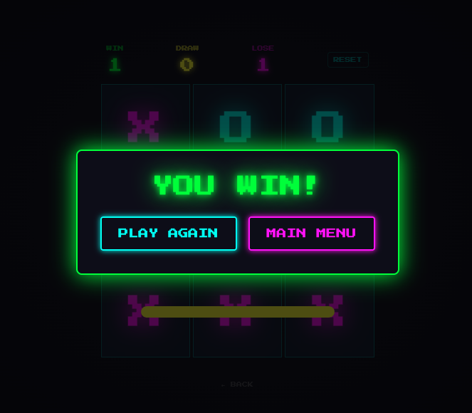

# Arcade Tic-Tac-Toe

A commercial-grade Tic-Tac-Toe game with a retro neon arcade aesthetic, built with React and deployed on Firebase Hosting.

🎮 **Live Demo → <a href="https://arcade-ttt.web.app" target="_blank">arcade-ttt.web.app</a>**



---

## Features

### Gameplay
- Player vs CPU — single player experience
- **3 difficulty levels:**
  - **Easy** — CPU makes random moves
  - **Medium** — CPU alternates between smart and random moves
  - **Hard** — CPU uses the Minimax algorithm and is completely unbeatable

### Visuals & UI
- Retro neon arcade theme inspired by 80s arcade cabinets
- Press Start 2P pixel font
- Fully responsive — works on mobile, tablet, and desktop
- Neon-colored X and O pieces with glow effects
- Custom color palette: neon cyan, magenta, green, and yellow

### Animations
- Board entrance animation on game start
- Piece placement animation on every move
- Animated SVG win line drawn across the winning combination
- Screen shake effect on loss
- Neon particle burst on win
- Bounce-in game over modal

### Audio
- Retro 8-bit sound effects generated entirely via the Web Audio API
- Distinct sounds for: piece placement, win, loss, and draw


### Score Tracking
- Win / Draw / Lose counters
- Scores persist across browser sessions via localStorage
- One-click score reset

---

## Tech Stack

| Category | Technology |
|----------|------------|
| Framework | React 19 |
| Build Tool | Vite 7 |
| Styling | Tailwind CSS v4 |
| Algorithm | Minimax (Hard AI) |
| Audio | Web Audio API |
| Graphics | HTML5 Canvas API |
| Font | Press Start 2P (Google Fonts) |
| Hosting | Firebase Hosting |
| Version Control | Git & GitHub |

---

## Project Structure

```
src/
├── components/
│   ├── TitleScreen.jsx       # Main menu
│   ├── DifficultySelect.jsx  # Difficulty picker
│   ├── GameBoard.jsx         # Core game board
│   ├── Cell.jsx              # Individual grid cell
│   ├── WinLine.jsx           # SVG animated win line
│   ├── ScoreBoard.jsx        # Score display
│   ├── GameOverModal.jsx     # Win/lose/draw overlay
│   └── ParticleEffect.jsx    # Canvas particle burst
├── game/
│   ├── constants.js          # Game constants and win combinations
│   ├── engine.js             # Win detection, draw detection
│   └── ai.js                 # CPU AI with Minimax algorithm
├── hooks/
│   ├── useGameState.js       # Core game state management
│   ├── useScore.js           # localStorage score tracking
│   └── useSound.js           # Web Audio API sound effects
└── utils/
    └── particles.js          # Particle system logic
```

---

